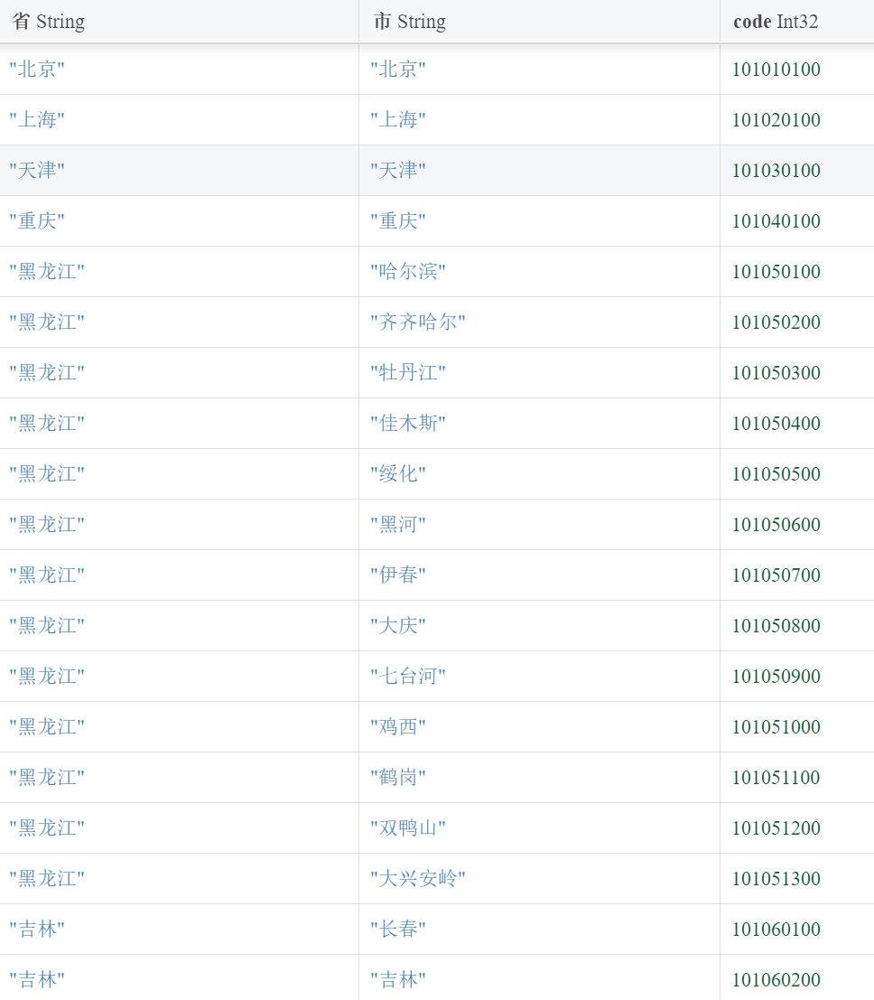
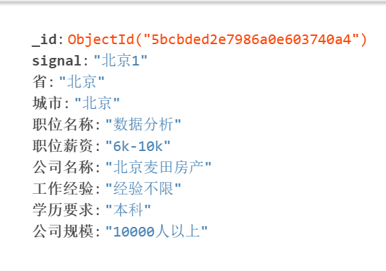
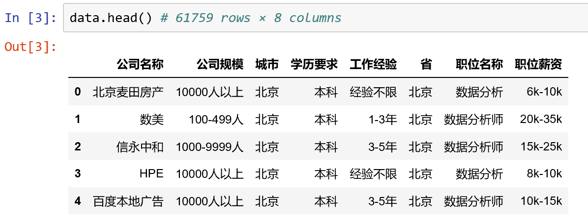
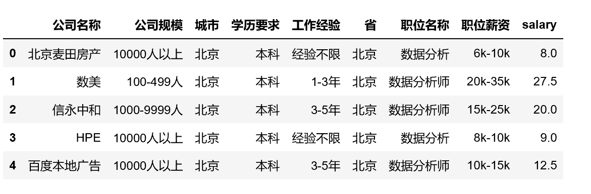
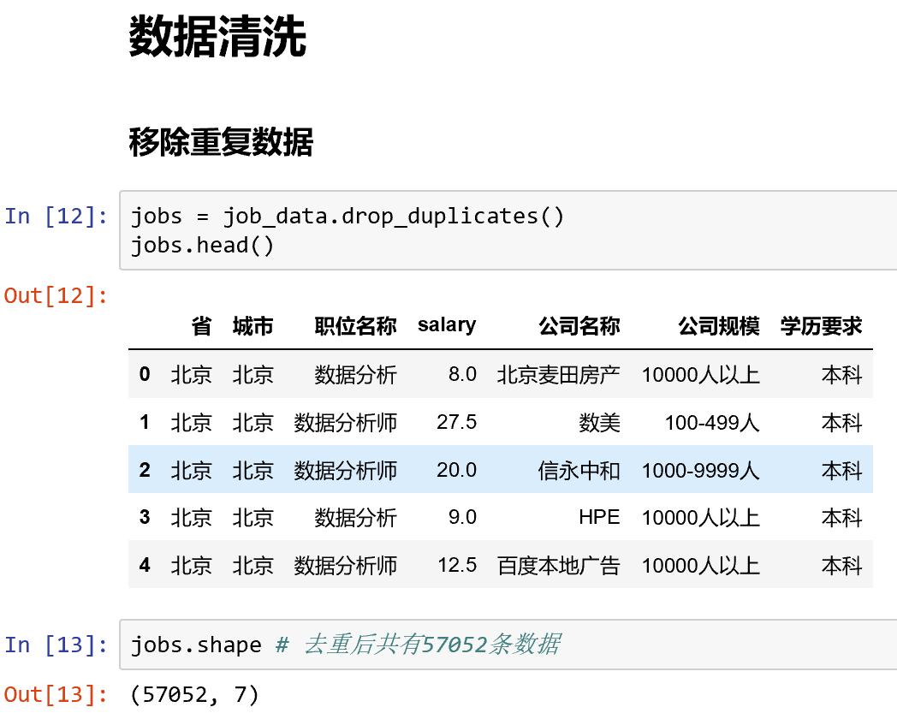
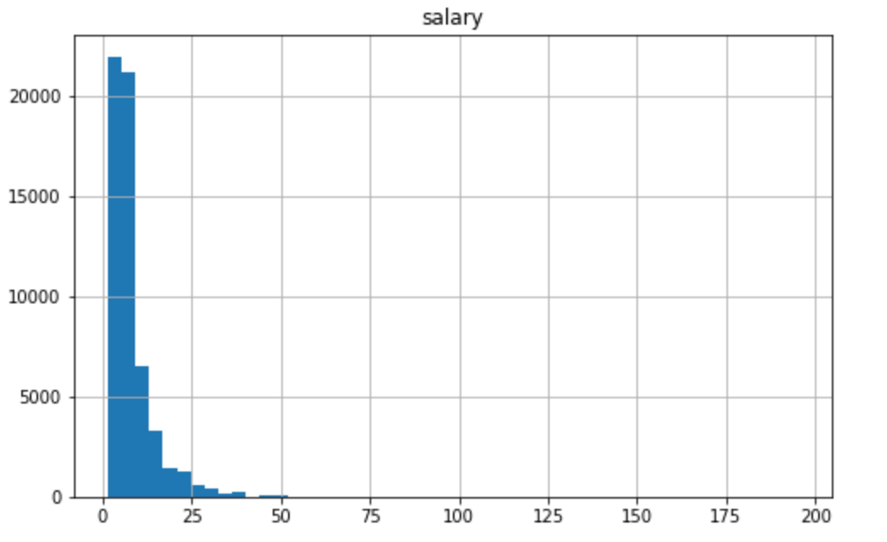
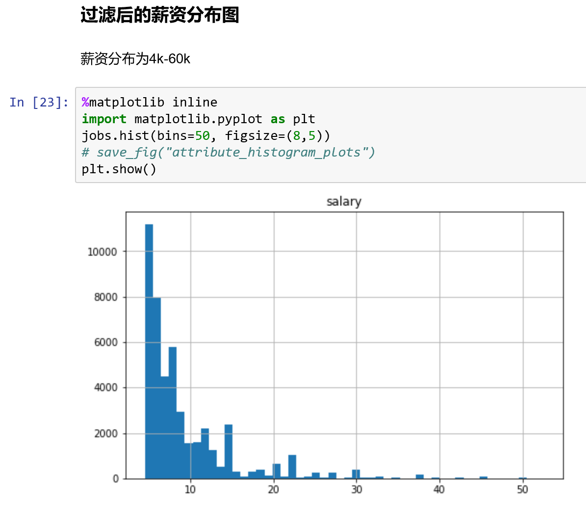
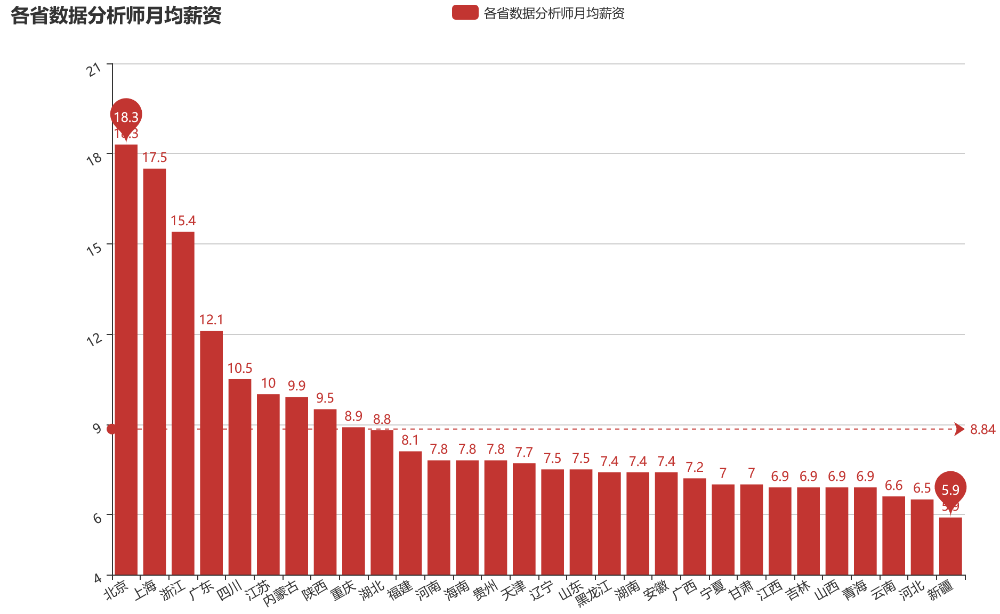
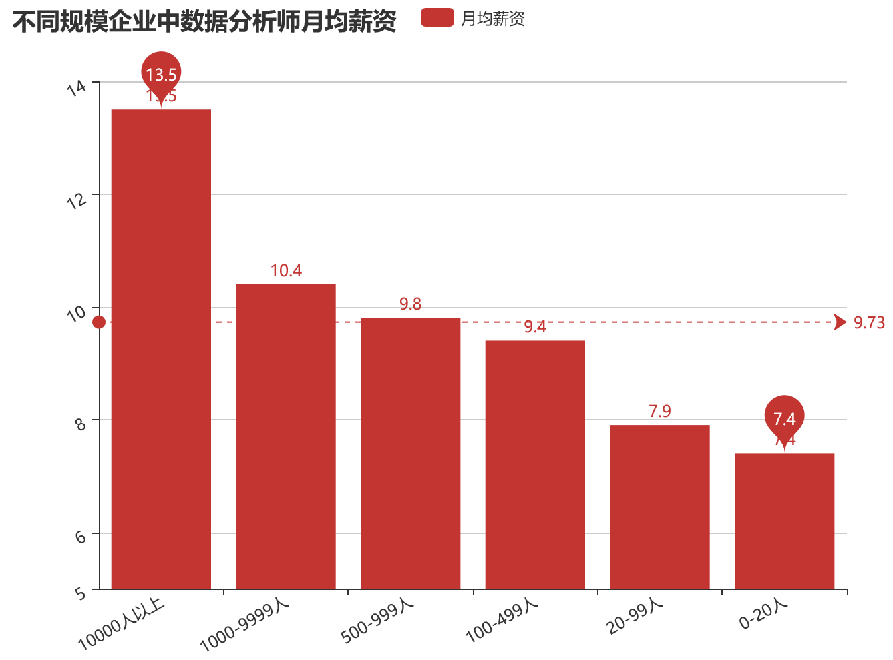
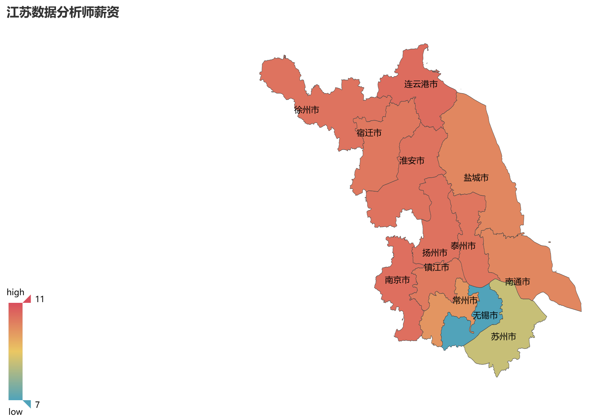

# BOSS直聘的数据分析
---
## 库依赖
- 基于Python3.6
- Jupyter Notebook
- pyecharts
- pymongo
- pandas
- numpy
---
## 爬虫实现过程
### 分析URL

- c后的编号对应不同城市
- page后的数字则对应页码

---

### 爬取所有省、市对应的code
city.py实现地区与对应code的爬取

---
### 根据codelist爬取所有地区的职位
- 爬取内容包含：signal、省、市、职位名称、薪资、公司名称、工作经验、学历要求、公司规模。

- signal字段作用在于重复爬取时跳过已爬取的页面。
- 存入MongoDB中

---
## 进行数据分析
### 读取数据
利用pandas读取数据库中数据

---
### 添加新列：salary
利用正则提取出[职位薪资]

---
### 数据清洗 
- 移除重复数据

---

- 数据筛选过滤，去除过高和过低的薪资

- 去除与“数据分析”无关的岗位信息

---
## 数据可视化

---

---

---

---

---
